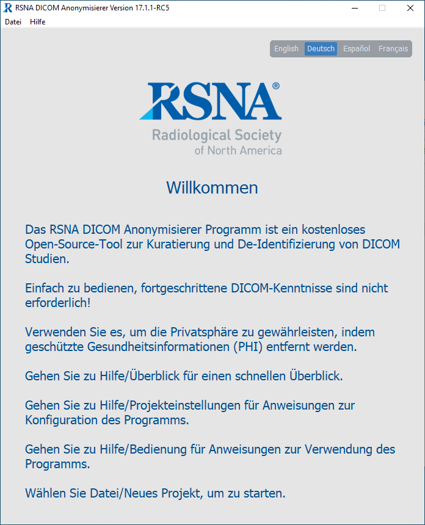

# RSNA DICOM Anonymisierer V17

## Installation 
Wählen Sie den richtigen Binärdownload für Ihre Plattform aus den verfügbaren [Versionen](https://github.com/mdevans/anonymizer/releases) aus.
### Windows
1. Laden Sie die ZIP-Datei herunter und extrahieren Sie sie in das gewünschte Anwendungsverzeichnis.
2. Führen Sie Anonymizer.exe aus und überschreiben Sie die Benutzerkontensteuerung, um dem Programm das Ausführen zu ermöglichen.
3. Die Protokolle werden in `~/AppData/Local/Anonymizer` geschrieben.
### Mac OSX
1. Laden Sie die ZIP-Datei herunter und extrahieren Sie sie in das gewünschte Anwendungsverzeichnis.
2. Klicken Sie auf die Datei `Anonymizer_17.*.dmg`, um das Laufwerk zu mounten, wobei * die entsprechende Version ist.
3. Ziehen Sie das Anonymzier-Symbol in den Ordner "Applications", wenn das Finder-Fenster angezeigt wird.
4. Warten Sie, bis die Anwendung dekomprimiert und kopiert wurde.
5. Öffnen Sie ein Terminal (`/Applications/Utilities/Terminal`) 
6. Um erweiterte Attribute zu entfernen, führen Sie im Terminal den Befehl aus: `xattr -rc /Applications/Anonymizer_17.*.app`.
7. Doppelklicken Sie auf das Anwendungssymbol, um es auszuführen.
8. Die Protokolle werden in `~/Library/Logs/Anonymizer/anonymizer.log` geschrieben.
### Linux
1. Laden Sie die ZIP-Datei herunter und extrahieren Sie sie in das gewünschte Anwendungsverzeichnis.
2. Öffnen Sie ein Terminal und wechseln Sie zum Anwendungsverzeichnis.
3. Geben Sie `chmod +x Anonymizer_17.*` ein, wobei * die entsprechende Version ist.
4. Führen Sie `./Anonymizer_17.*` aus.
5. Die Protokolle werden in `~/Logs/Anonymizer/anonymizer.log` geschrieben.
## Dokumentation
[Hilfedateien](https://mdevans.github.io/anonymizer/index.html)
