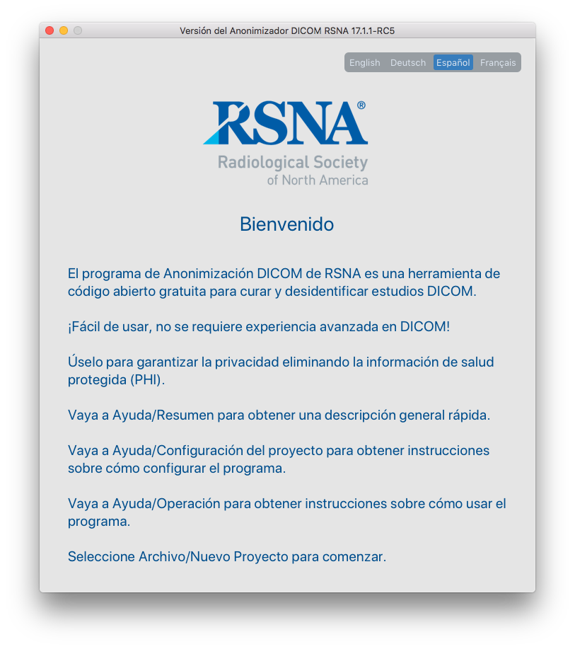

# RSNA DICOM Anonimizador V17

## Instalación 
Seleccione la descarga binaria correcta para su plataforma de las [versiones disponibles](https://github.com/mdevans/anonymizer/releases)
### Windows
1. Descargue y extraiga el archivo zip en el directorio de aplicación deseado.
2. Ejecute Anonymizer.exe y anule el Control de cuentas de usuario para permitir que el programa se ejecute de todos modos.
3. Los registros se escribirán en `~/AppData/Local/Anonymizer`
### Mac OSX
1. Descargue y extraiga el archivo zip en el directorio de aplicación deseado.
2. Monte el disco haciendo clic en el archivo `Anonymizer_17.*.dmg`, donde * es la versión relevante.
3. En la ventana del Finder que se presenta, arrastre el icono de Anonymizer a la carpeta Aplicaciones.
4. Espere a que la aplicación se descomprima y copie.
5. Abra una terminal (`/Applications/Utilities/Terminal`) 
6. Para eliminar los atributos extendidos, en la terminal, ejecute el comando: `xattr -rc /Applications/Anonymizer_17.*.app`.
7. Haga doble clic en el icono de la aplicación para ejecutarla.
8. Los registros se escribirán en `~/Library/Logs/Anonymizer/anonymizer.log`
### Linux
1. Descargue y extraiga el archivo zip en el directorio de aplicación deseado.
2. Abra una terminal y vaya al directorio de la aplicación.
3. `chmod +x Anonymizer_17.*`, donde * es la versión relevante.
4. Ejecute `./Anonymizer_17.*` 
5. Los registros se escribirán en `~/Logs/Anonymizer/anonymizer.log`
## Documentación
[Archivos de ayuda](https://mdevans.github.io/anonymizer/index.html)
