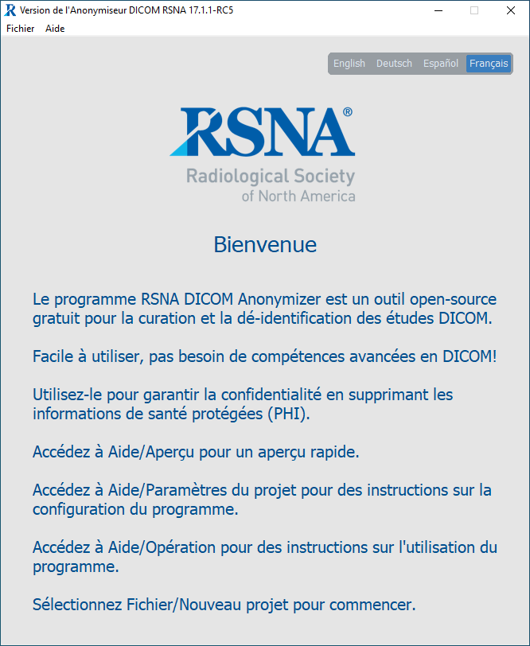

# RSNA DICOM l'Anonymiseur V17

## Installation 
Sélectionnez le téléchargement binaire correct pour votre plateforme parmi les [versions disponibles](https://github.com/mdevans/anonymizer/releases)
### Windows
1. Téléchargez et extrayez le fichier zip dans le répertoire d'application souhaité.
2. Exécutez Anonymizer.exe et autorisez le contrôle de compte d'utilisateur à permettre au programme de "S'exécuter quand même".
3. Les journaux seront écrits dans `~/AppData/Local/Anonymizer`
### Mac OSX
1. Téléchargez et extrayez le fichier zip dans le répertoire d'application souhaité.
2. Montez le disque en cliquant sur le fichier `Anonymizer_17.*.dmg` où * est la version pertinente.
3. Dans la fenêtre du Finder présentée, faites glisser l'icône Anonymizer vers le dossier Applications.
4. Attendez que l'application soit décompressée et copiée.
5. Ouvrez un terminal (`/Applications/Utilities/Terminal`) 
6. Pour supprimer les attributs étendus, dans le terminal, exécutez la commande : `xattr -rc /Applications/Anonymizer_17.*.app`.
7. Double-cliquez sur l'icône de l'application pour l'exécuter.
8. Les journaux seront écrits dans `~/Library/Logs/Anonymizer/anonymizer.log`
### Linux
1. Téléchargez et extrayez le fichier zip dans le répertoire d'application souhaité.
2. Ouvrez un terminal et accédez au répertoire de l'application.
3. `chmod +x Anonymizer_17.*` où * est la version pertinente.
4. Exécutez `./Anonymizer_17.*` 
5. Les journaux seront écrits dans `~/Logs/Anonymizer/anonymizer.log`
## Documentation
[Fichiers d'aide](https://mdevans.github.io/anonymizer/index.html)
